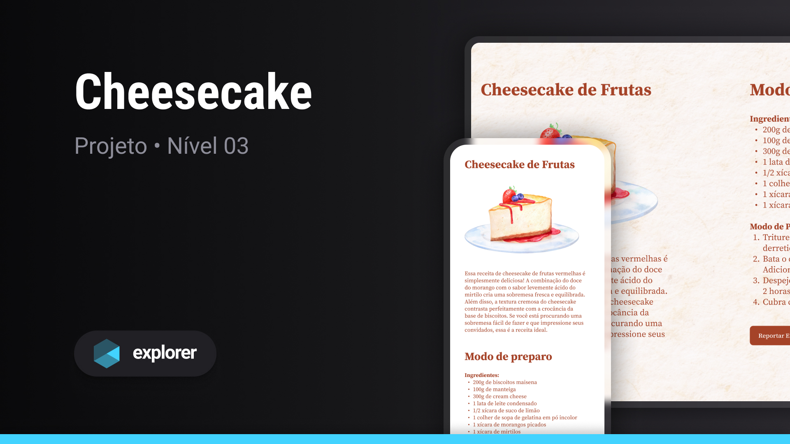

 

  <h1 align="center"> Explorer Stage 03 - Cheesecake Recipe 📝</h1>

## ✏️ About

> Project developed in Stage 3 of the Explorer course by [Rocketseat](https://www.rocketseat.com.br/) 🚀

## ⚙ Technologies

 

  
  

 

## 💻 Project

To access the project, click the link below:

[🔗 Click here to access](https://github.com/juliannalencar/explorer-rocket/tree/main/05-responsividade_cheesecake)

## 🎨 Layout

To access the project layout on Figma, click the link below:

🔗 [View on Figma](https://www.figma.com/community/file/1256354643188696521)

## 📫 Contact

  
  

 

<h4 align="center">Made with 💙 by Julianna D. Alencar 👋🏻</h4>